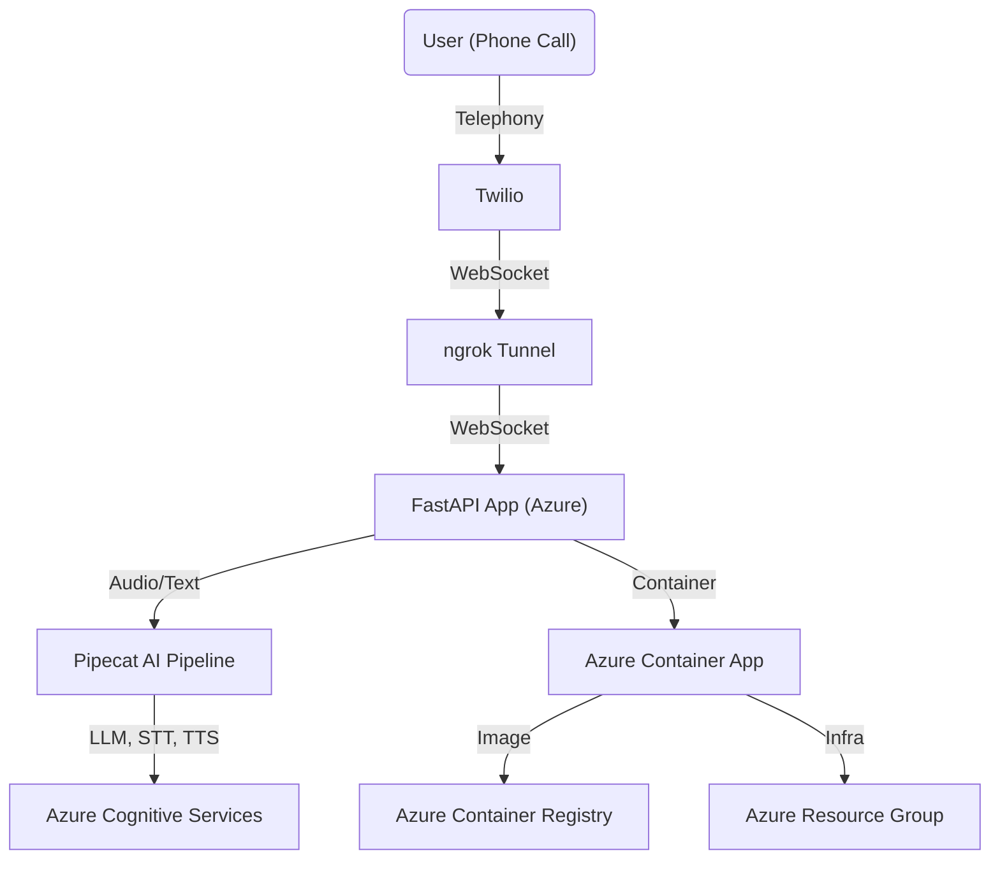

<h1 align="center">
Pipecat Voice Agent in Azure
</h1>

[](https://azure.microsoft.com/en-us/products/container-apps)
[](https://fastapi.tiangolo.com/)
[](https://www.terraform.io/)
[](https://www.twilio.com/)
[](https://github.com/mahimairaja/pipecat-agent-in-azure/stargazers)

> **Production-Ready Voice AI Agent on Azure Container Apps with FastAPI, Pipecat, and Twilio Telephony**


## Overview

**pipecat-agent-in-azure** is a blazing-fast, production-grade voice assistant powered by [Pipecat AI](https://github.com/pipecat-ai/pipecat), deployed seamlessly to Azure using Container Apps and managed with Terraform. This project is your one-stop solution for building, deploying, and scaling conversational AI on the cloud, with modern DevOps best practices—and it connects to the real phone network using Twilio and ngrok!


## Features

- **Conversational Voice Agent**: Real-time, low-latency voice interaction using FastAPI and Pipecat AI.
- **Azure-Native Deployment**: Effortless deployment to Azure Container Apps, leveraging Azure's scalability and reliability.
- **Telephony Integration**: Connects to Twilio phone numbers to answer real phone calls with AI.
- **ngrok Webhook Support**: Expose your app securely for Twilio webhooks, even during local development.
- **Infrastructure as Code**: Fully reproducible, modular infrastructure with Terraform.
- **CI/CD Ready**: Designed for modern workflows—just push, build, and deploy.
- **Secure & Scalable**: Uses Azure Container Registry, resource groups, and best practices for cloud security.
- **Easy Customization**: Tweak the agent, add integrations, or scale up with minimal effort.


## Architecture




## Telephony Integration

- **Twilio**: Buy a phone number and configure its webhook to point to your ngrok URL (e.g., `wss://<ngrok-id>.ngrok-free.app/ws`).
- **ngrok**: Securely exposes your FastAPI WebSocket endpoint to the public internet for Twilio to reach your app, even if running locally or behind a firewall.
- **End-to-End Voice AI**: When someone calls your Twilio number, their voice is streamed to your Azure-hosted agent, processed by LLM/STT/TTS, and the AI's voice is streamed back in real time.


##  Quick Start

### 1. Clone & Configure
```bash
git clone https://github.com/mahimairaja/pipecat-agent-in-azure.git
cd pipecat-agent-in-azure/app
cp .env.example .env  # Add your Azure keys
```

### 2. Build & Push Docker Image
```bash
docker build -t myfoundaryregistry.azurecr.io/pipecat-agent:latest .
# Login to ACR
docker login myfoundaryregistry.azurecr.io
# Push image
docker push myfoundaryregistry.azurecr.io/pipecat-agent:latest
```

### 3. Deploy Infrastructure & App
```bash
cd ../infrastructure
terraform init
terraform apply
```

### 4. Expose Your App with ngrok
```bash
ngrok http 8000
# Copy the wss://... URL for your /ws endpoint
```

### 5. Configure Twilio Webhook
- In the Twilio Console, set your phone number's webhook to your ngrok URL (e.g., `wss://<ngrok-id>.ngrok-free.app/ws`).

### 6. Call Your Twilio Number
- Speak to your AI agent live over the phone!


## Contributing

Want to make this agent smarter, faster, or more fun? PRs are welcome! Star the repo to support the project and help others discover it.

- Open issues for bugs or feature requests
- Fork and submit pull requests
- Share your use cases and feedback!


## At a glance

- **Azure-native, scalable, and secure**
- **Telephony integration for real-world use**
- **DevOps best practices out of the box**
- **Great starting point for your own AI agent**


Built with ❤️ by [Mahimai](https://github.com/mahimairaja)